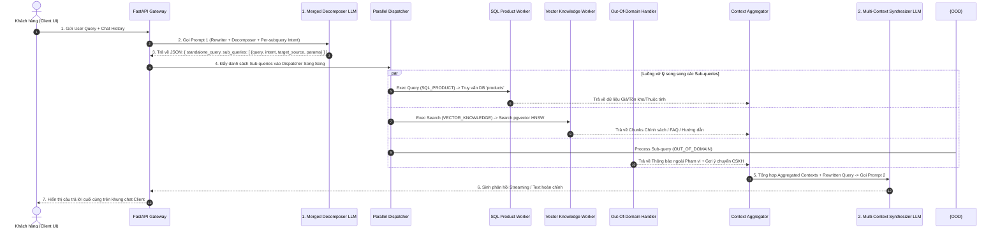

# 📖 ĐẶC TẢ KIẾN TRÚC KỸ THUẬT & LUỒNG XỬ LÝ KH-06 NÂNG CẤP
> **Hybrid RAG + Sub-query Decomposition + Per-subquery Intent Router (Loại bỏ Score Thresholding & Tích hợp Domain Scope Boundary)**

---

## 1. 🎯 Tổng quan & Điểm Cải tiến Kiến trúc

### 1.1. Bối cảnh & Lý do Chọn Phương án KH-06 Nâng cấp
Qua quá trình thử nghiệm thực nghiệm các giải pháp kiến trúc RAG từ KH-01 đến KH-08, phương án **KH-06 (Hybrid RAG + Sub-query Decomposition)** tỏ ra vượt trội trong việc xử lý các câu hỏi phức tạp ghép nhiều ý của khách hàng (ví dụ: vừa hỏi thông tin sản phẩm, vừa hỏi chính sách giao hàng, vừa hỏi thắc mắc chăm sóc).

Tuy nhiên, phiên bản KH-06 ban đầu được tinh chỉnh và nâng cấp để đáp ứng tối ưu môi trường vận hành thực tế:

| Thành phần | Phiên bản KH-06 Ban đầu | Phiên bản KH-06 Nâng cấp (Hiện tại) | Lý do Tối ưu |
| --- | --- | --- | --- |
| **Score Thresholding** | Có sử dụng ngưỡng điểm Similarity / Re-rank | **LOẠI BỎ HOÀN TOÀN** | Việc lọc ngưỡng điểm làm mất dữ liệu câu hỏi sát nghĩa nhưng điểm khoảng cách vector thấp. Scope & Intent đã được phân loại chính xác ở bước Decomposer nên không cần Score Thresholding. |
| **Intent Router** | Đánh giá 1 Intent chung cho toàn bộ Query gộp | **Phân Intent độc lập cho TỪNG Sub-query** | Một câu hỏi gộp có thể chứa cả ý hỏi sản phẩm (`SQL_PRODUCT`), ý hỏi bảo hành (`VECTOR_KNOWLEDGE`) và câu hỏi ngoài phạm vi (`OUT_OF_DOMAIN`). Phân Intent theo sub-query giúp định tuyến chính xác từng ý nhỏ. |
| **Phạm vi Domain (Scope Boundary)** | Chưa định nghĩa rõ ràng trong Prompt 1 | **Tích hợp sẵn `# DOMAIN BOUNDARY SCOPE` vào Merged Decomposer Prompt** | Giúp LLM Decomposer nhận biết chính xác giới hạn nghiệp vụ của cửa hàng Đồ dùng Thú cưng, từ đó gán nhãn `OUT_OF_DOMAIN` chuẩn xác ngay bước bẻ câu hỏi. |
| **Xử lý Out of Domain** | Trả về thông báo lỗi chung | **Xử lý Fallback linh hoạt per Sub-query** | Nhánh `OUT_OF_DOMAIN` tự động đưa ra câu trả lời giải thích thông tin nằm ngoài phạm vi cửa hàng và chủ động gợi ý kết nối với nhân viên tư vấn. |

---

## 2. 🔄 Luồng Xử lý Chi tiết từ A-Z (End-to-End Execution Flow)

Luồng dữ liệu được bắt đầu ngay khi người dùng gửi một tin nhắn lên khung chat cho đến khi nhận được câu trả lời tổng hợp hoàn chỉnh:



---

### 🔍 Đặc tả 5 Bước Luồng Thực thi Kỹ thuật:

#### Bước 1: Tiếp nhận Query & Lịch sử Hội thoại (Input Ingestion)
* **Đầu vào:** `user_query` (nội dung người dùng nhập) và `chat_history` (5-10 tin nhắn liền trước).
* **Mục đích:** Cung cấp ngữ cảnh để giải quyết từ xưng hô, đại từ thay thế (VD: *"nó có giá bao nhiêu?", "loại này có ship về Hà Nội không?"*).

#### Bước 2: Merged Decomposer & Per-subquery Intent Router (LLM Call 1)
* **Thực thi:** Gọi LLM với `MERGED_DECOMPOSER_PROMPT_KH06`.
* **Nhiệm vụ:**
  1. **Coreference Resolution:** Chuẩn hóa câu hỏi thành câu đứng độc lập (`standalone_query`).
  2. **Sub-query Decomposition:** Bẻ câu hỏi phức tạp thành danh sách các `sub_queries` nguyên tử.
  3. **Domain Scope Enforcement:** Kiểm tra đối chiếu với `# DOMAIN BOUNDARY SCOPE`.
  4. **Per-subquery Intent & Target Source Assignment:** Gán `intent` và `target_source` độc lập cho từng `sub_query`:
     * `SQL_PRODUCT`: Câu hỏi về giá, số lượng tồn kho, kích thước, trọng lượng, thương hiệu của sản phẩm cụ thể $\rightarrow$ Gán tham số SQL (`product_search_keyword`, `pet_type`, `category`).
     * `VECTOR_KNOWLEDGE`: Câu hỏi về chính sách (đổi trả, ship, thanh toán), tư vấn hướng dẫn sử dụng, mẹo chăm sóc thú cưng, FAQ sản phẩm.
     * `OUT_OF_DOMAIN`: Câu hỏi ngoài phạm vi kinh doanh của cửa hàng (VD: hỏi mua động vật sống như chó/mèo/heo, hỏi giá vàng, hỏi chính trị, dịch vụ thú y khám chữa bệnh cấp cứu...).
     * `GREETING_CHITCHAT`: Trào hỏi xã giao (VD: *"chào bạn", "hello"*).
     * `HUMAN_AGENT_REQUEST`: Yêu cầu gặp trực tiếp tư vấn viên người thật.

#### Bước 3: Phân luồng & Thực thi Song song (Parallel Multi-Branch Worker Execution)
Hệ thống sử dụng `asyncio.gather()` hoặc `ThreadPoolExecutor` để thực thi tất cả các `sub_queries` đồng thời:

* **Nhánh A — `SQL_PRODUCT` Worker:**
  * Nhận các tham số bóc tách từ LLM (`product_search_keyword`, `pet_type`, `category`).
  * Thực thi câu lệnh SQL Parameterized query tới bảng `products` trong Supabase PostgreSQL để lấy chính xác giá bán, tồn kho real-time và thuộc tính sản phẩm.
* **Nhánh B — `VECTOR_KNOWLEDGE` Worker:**
  * Nhận chuỗi `query` của sub-query.
  * Gọi mô hình Embedding tạo vector query, thực hiện truy vấn khoảng cách Cosine trên bảng `knowledge_chunks` (Supabase `pgvector` HNSW Index `vector_cosine_ops`).
  * **Lưu ý:** Không sử dụng bất kỳ Score Threshold nào; lấy Top-K (VD: Top 3) kết quả có khoảng cách tốt nhất.
* **Nhánh C — `OUT_OF_DOMAIN` Worker:**
  * Với mỗi sub-query bị gán nhãn `OUT_OF_DOMAIN`, Worker tự động đóng gói một đoạn ngữ cảnh fallback:
    > *"Dữ liệu ngoài phạm vi: Câu hỏi '[Nội dung Sub-query]' nằm ngoài danh mục kinh doanh và hỗ trợ của cửa hàng PetHome (Chuỗi đồ dùng thú cưng). Hệ thống đã ghi nhận và có thể chuyển tin nhắn này đến Nhân viên CSKH để hỗ trợ trực tiếp nếu khách hàng yêu cầu."*
* **Nhánh D — `HUMAN_AGENT_REQUEST` / `GREETING_CHITCHAT` Worker:**
  * Trả về ghi chú kích hoạt cờ chuyển đổi trạng thái `mode = 'WAITING_HUMAN'` hoặc ghi chú phản hồi chào hỏi.

#### Bước 4: Gom Ngữ cảnh (Context Aggregation)
* `Context Aggregator` nhận kết quả từ tất cả các nhánh Worker song song.
* Gom toàn bộ dữ liệu thành một khối cấu trúc văn bản duy nhất `<aggregated_contexts>`, được phân rõ theo từng `Sub-query ID`:
  ```text
  --- SUB-QUERY 1 [Intent: SQL_PRODUCT] ---
  Retrieved Product Catalog: [Thức ăn Mèo Royal Canin Indoor 2kg - Giá: 380,000đ - Tồn kho: 15 túi]

  --- SUB-QUERY 2 [Intent: VECTOR_KNOWLEDGE] ---
  Retrieved Policy Chunk: [Chính sách Giao hàng: Miễn phí vận chuyển cho đơn hàng từ 500,000đ nội thành...]

  --- SUB-QUERY 3 [Intent: OUT_OF_DOMAIN] ---
  Notice: Câu hỏi về 'dịch vụ tiêm phòng dại tại nhà' nằm ngoài phạm vi kinh doanh của cửa hàng.
  ```

#### Bước 5: Sinh Phản hồi Cuối cùng (Multi-Context Synthesizer - LLM Call 2)
* **Thực thi:** Gọi LLM với `MULTI_CONTEXT_SYNTHESIZER_PROMPT_KH06`.
* **Nhiệm vụ:**
  * Đọc toàn bộ `<aggregated_contexts>` và `rewritten_query`.
  * Tổng hợp thành 1 câu trả lời duy nhất: vừa tư vấn chính xác thông tin sản phẩm & chính sách, vừa lịch sự giải thích về câu hỏi ngoài phạm vi và đưa ra lời mời kết nối nhân viên CSKH nếu khách hàng muốn.

---

## 3. 📄 Tập Prompts Kỹ thuật Chuẩn hóa (Prompts Specification)

### 3.1. Merged Decomposer Prompt (`MERGED_DECOMPOSER_PROMPT_KH06`)

```text
# ROLE & TASK
You are the Lead Multi-Task Query Decomposer & Intent Router for PetHome - An Omnichannel Pet Supplies & Equipment Store.
Analyze <chat_history> and <user_query> to perform:
1. COREFERENCE RESOLUTION: Rewrite <user_query> into a standalone, explicit query resolving all pronouns.
2. SUB-QUERY DECOMPOSITION: If the query contains multiple distinct sub-questions (e.g. price AND shipping policy AND out-of-scope question), split it into focused atomic sub-queries.
3. PER-SUBQUERY INTENT & ROUTING: For each sub-query, enforce the # DOMAIN BOUNDARY SCOPE to classify its exact intent and target source.

# DOMAIN BOUNDARY SCOPE
1. STORE TYPE: Pet Supplies, Equipment & Accessories Store (Food, litter, toys, grooming tools, bowls, cages. NO live animals/pets sold).
2. SUPPORTED POLICIES: CSKH & Agent Transfer, Returns & Refunds, Shipping & Delivery, Payment methods.
3. SUPPORTED PRODUCT CATEGORIES: Thức ăn, Vệ sinh, Đồ chơi, Phụ kiện, Chăm sóc.
4. SUPPORTED PET TYPES: Dogs (Chó), Cats (Mèo), Birds (Chim), Small Pets (Thỏ, Hamster, Bọ ú).
   - UNSUPPORTED: Livestock or wild animals (Bò, Ngựa, Trâu, Heo, Voi...), Veterinary Medical Treatments/Surgeries, Non-pet topics (Gold prices, Politics, General News...).

# INTENT & TARGET SOURCE DEFINITIONS PER SUB-QUERY
- `SQL_PRODUCT`: Inquiries about product price, stock quantity, size, weight, brand, flavor, or availability in relational database.
- `VECTOR_KNOWLEDGE`: Inquiries about store policies (returns, shipping, payment), usage guides, pet care advice, or product FAQs.
- `OUT_OF_DOMAIN`: Inquiries violating or outside the # DOMAIN BOUNDARY SCOPE (e.g. buying live dogs/cats, vet medical procedures, non-pet topics).
- `GREETING_CHITCHAT`: Greetings, thanks, or general pleasantries.
- `HUMAN_AGENT_REQUEST`: Direct requests to talk to a human consultant/agent.

# SQL SCHEMA ATTRIBUTES (`products` table)
Fields: name, sku, category [Thức ăn, Vệ sinh, Đồ chơi, Phụ kiện, Chăm sóc], pet_type [CAT, DOG, BIRD, SMALL_PET], price, sale_price, stock_quantity, status, brand, weight, volume, flavor.

# INPUT
<chat_history>
{chat_history}
</chat_history>

<user_query>
{user_query}
</user_query>

# OUTPUT FORMAT (STRICT JSON ONLY - NO MARKDOWN TRIPLE BACKTICKS)
{
  "standalone_query": "Fully rewritten standalone user query",
  "reasoning": "Brief 1-sentence reasoning for the decomposition and intent routing",
  "is_complex": true,
  "sub_queries": [
    {
      "id": 1,
      "query": "Atomic sub-query string 1",
      "intent": "SQL_PRODUCT" | "VECTOR_KNOWLEDGE" | "OUT_OF_DOMAIN" | "GREETING_CHITCHAT" | "HUMAN_AGENT_REQUEST",
      "target_source": "SQL_PRODUCT" | "VECTOR_KNOWLEDGE" | "NONE",
      "product_search_keyword": "Extracted product name or keyword (or null)",
      "pet_type": "CAT" | "DOG" | "BIRD" | "SMALL_PET" | null,
      "category": "Thức ăn" | "Vệ sinh" | "Đồ chơi" | "Phụ kiện" | "Chăm sóc" | null
    }
  ]
}
```

---

### 3.2. Multi-Context Synthesizer Prompt (`MULTI_CONTEXT_SYNTHESIZER_PROMPT_KH06`)

```text
# ROLE & BRAND PERSONA
You are PetHome Assistant - The friendly, professional AI Customer Support Agent for PetHome Việt Nam (Chuỗi Cửa hàng Đồ dùng & Phụ kiện Thú cưng).

# INSTRUCTIONS & OPERATIONAL CONSTRAINTS
1. COMPLETE COVERAGE: Address ALL customer sub-questions in structured bullet points. Do NOT leave any sub-topic unanswered.
2. GROUNDING & ACCURACY: 
   - For Product & Policy queries: Use strictly the factual context in <aggregated_contexts>. Quote exact prices, stock statuses, and policy conditions.
3. OUT OF DOMAIN HANDLING:
   - For sub-queries marked as OUT_OF_DOMAIN: Politely explain that PetHome specializes in pet supplies/accessories and does not support/provide that item/service. Always ask if they would like to connect with a human support agent for further assistance.
4. TONE & FORMAT: Warm, helpful, professional Vietnamese. Use bullet points for clear readability.

# AGGREGATED RETRIEVAL CONTEXTS
<aggregated_contexts>
{aggregated_contexts}
</aggregated_contexts>

# ORIGINAL USER QUERY
<user_query>
{standalone_query}
</user_query>

# RESPONSE GENERATION
Synthesize a comprehensive response covering all parts of the customer query:
```

---

## 4. 📊 Cấu trúc Dữ liệu Chuyển giao (Data Schemas)

### 4.1. Mẫu JSON Đầu ra của Decomposer (LLM Step 1 Output)

```json
{
  "standalone_query": "Cát vệ sinh Cature 6L có giá bao nhiêu, chính sách freeship thế nào và shop có bán mèo con Anh lông ngắn không?",
  "reasoning": "Query chứa 3 ý riêng biệt: Giá sản phẩm (SQL), Chính sách vận chuyển (Vector), và Hỏi mua động vật sống (Out of Domain).",
  "is_complex": true,
  "sub_queries": [
    {
      "id": 1,
      "query": "Giá và tồn kho của cát vệ sinh Cature 6L",
      "intent": "SQL_PRODUCT",
      "target_source": "SQL_PRODUCT",
      "product_search_keyword": "Cature 6L",
      "pet_type": "CAT",
      "category": "Vệ sinh"
    },
    {
      "id": 2,
      "query": "Chính sách miễn phí vận chuyển (freeship) của cửa hàng",
      "intent": "VECTOR_KNOWLEDGE",
      "target_source": "VECTOR_KNOWLEDGE",
      "product_search_keyword": null,
      "pet_type": null,
      "category": null
    },
    {
      "id": 3,
      "query": "Shop có bán mèo con Anh lông ngắn không",
      "intent": "OUT_OF_DOMAIN",
      "target_source": "NONE",
      "product_search_keyword": null,
      "pet_type": "CAT",
      "category": null
    }
  ]
}
```

### 4.2. Mẫu Phản hồi Cuối cùng Sinh ra cho Khách hàng (Client Output Sample)

> **Chào bạn, PetHome xin được giải đáp các thắc mắc của bạn như sau:**
>
> 1. **Về Cát vệ sinh Cature 6L:**
>    * **Giá bán:** 145.000đ / túi.
>    * **Tình trạng:** Hiện còn sẵn 24 túi tại kho.
>
> 2. **Về Chính sách Miễn phí Vận chuyển:**
>    * PetHome áp dụng **Freeship** cho tất cả các đơn hàng từ **500.000đ trở lên** trong khu vực nội thành.
>    * Đối với đơn hàng dưới 500.000đ, phí ship đồng giá nội thành là 20.000đ.
>
> 3. **Về việc Tìm mua Mèo con Anh lông ngắn:**
>    * PetHome là chuỗi cửa hàng chuyên cung cấp **đồ dùng, thức ăn và phụ kiện chăm sóc thú cưng**, bên mình **không bán các loại thú cưng/động vật sống**.
>    * Nếu bạn cần tư vấn thêm các vật dụng cần chuẩn bị trước khi đón bé mèo về nhà, bạn có muốn mình kết nối bạn với **Nhân viên tư vấn người thật** để hỗ trợ chi tiết hơn không ạ? 😊

---

## 5. 🛠️ Quy trình Kiểm thử & Xác minh (Verification Criteria)

Để đảm bảo kiến trúc KH-06 Nâng cấp hoạt động ổn định và chính xác:

1. **Testcase 1 (Query Đơn - In Domain):** *"Cát Cature giá bao nhiêu?"* $\rightarrow$ 1 Sub-query `SQL_PRODUCT`, lấy giá chính xác từ DB.
2. **Testcase 2 (Query Phức hợp - Mix SQL + Vector):** *"Pate Royal Canin cho mèo giá bao nhiêu và chính sách đổi trả thế nào?"* $\rightarrow$ 2 Sub-queries (`SQL_PRODUCT` + `VECTOR_KNOWLEDGE`), tổng hợp trọn vẹn 2 thông tin.
3. **Testcase 3 (Query Phức hợp - Mix In-Domain + Out-of-Domain):** *"Thức ăn cho cún 2kg giá bao nhiêu và shop có tiêm phòng dại tại nhà không?"* $\rightarrow$ 2 Sub-queries (`SQL_PRODUCT` + `OUT_OF_DOMAIN`), vừa báo giá thức ăn vừa giải thích không hỗ trợ dịch vụ tiêm phòng và mời nối máy CSKH.
4. **Testcase 4 (Query Hoàn toàn Out-of-Domain):** *"Shop có bán heo giống không?"* $\rightarrow$ 1 Sub-query `OUT_OF_DOMAIN`, trả lời lịch sự ngoài phạm vi + câu hỏi nối máy tư vấn viên.
